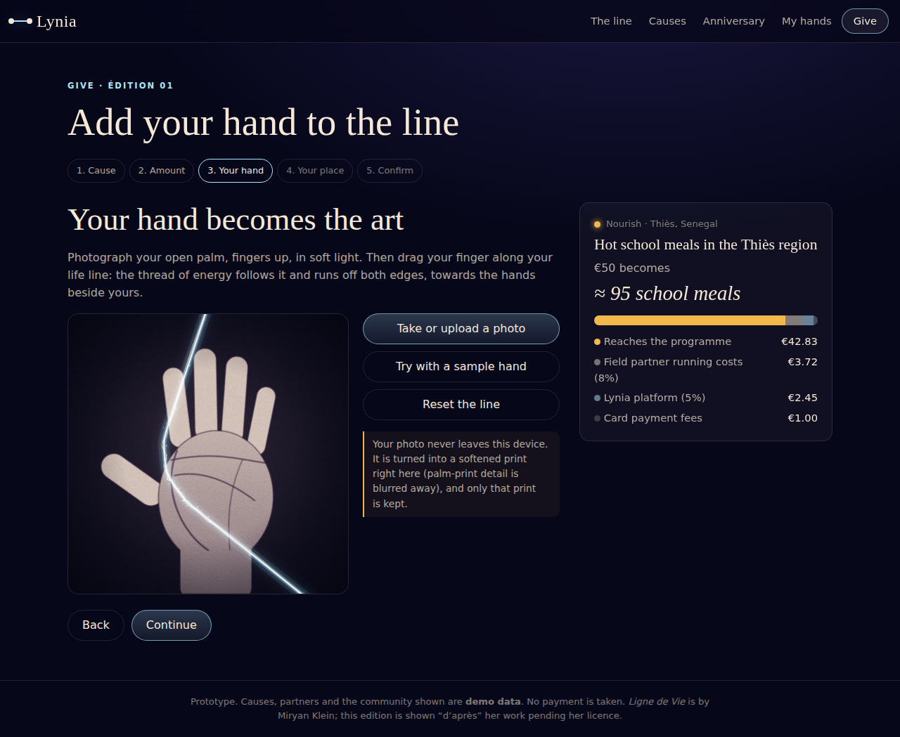
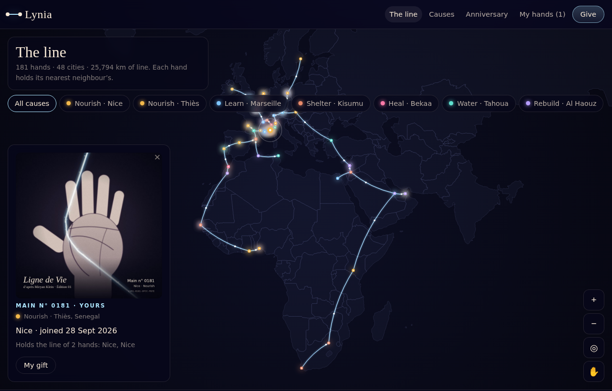
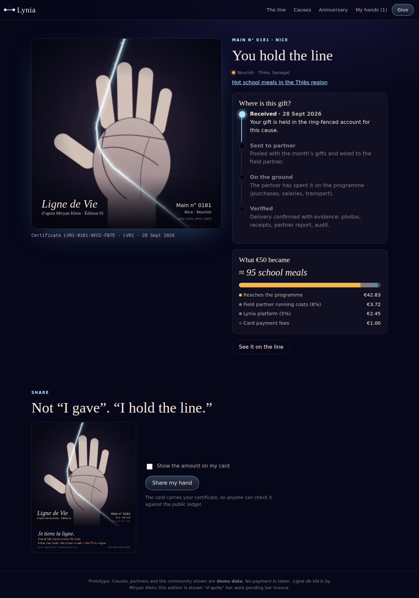
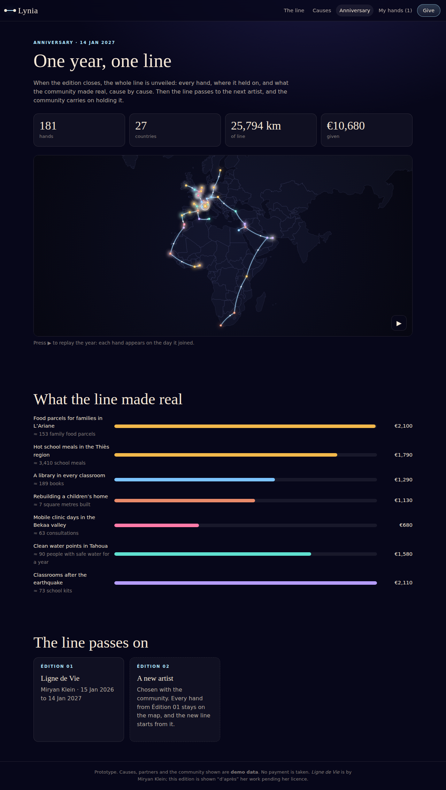

# Lynia · the art of giving

Every donation becomes a hand in a living artwork, and every euro is followed until someone on the ground confirms what it became.

The first edition is **_Ligne de Vie_, after Miryan Klein**: in Nice, on the tram line 2 construction hoardings by Square Durandy, she laid out photographs of about twenty anonymous hands whose life lines are joined by a translucent thread of energy. Lynia extends that line across Europe, the Middle East and Africa: one hand per gift, each holding the line of the nearest hand.

- **Vision, research and plan:** [docs/VISION.md](docs/VISION.md)
- **Prototype:** `app/` (plain HTML, CSS and ES modules, no build step, no dependencies)

| Your hand becomes the art | The line across EMEA |
| --- | --- |
|  |  |
|  |  |

## Run it

```bash
npm start      # http://localhost:5173
npm test       # unit tests for impact maths, the ledger, the line and certificates
```

Node 20 or newer. You can also serve `app/` with any static server.

## What you can do in the prototype

1. **Give:** choose a cause, see exactly what your amount becomes, photograph your palm (or use the sample hand), trace your life line, and pick your city.
2. **My hand:** your numbered print with its certificate, the "Where is this gift?" tracker, and a share card.
3. **The line:** the EMEA map of every hand, joined to its nearest neighbours, filterable by cause.
4. **Causes:** progress, concrete units funded, and monthly proof per cause.
5. **Anniversary:** the year's totals, a replay of the line growing, and the hand-over to the next artist.

Causes, partners and the community are **demo data**. No payment is taken. Your photo never leaves your device, and only the finished print is kept (in your browser).

## Layout

```
app/
  index.html, css/styles.css
  js/main.js            screens and routing
  js/core/              impact maths, ledger, geography (the line), certificates
  js/data/              edition, causes, cities, demo seed, EMEA outlines
  js/ui/                hand-to-art studio, the map, the share card
scripts/serve.mjs       zero-dependency static server
tests/                  node:test unit tests
docs/VISION.md          concept, research on the artist, cause catalogue, transparency, legal, roadmap
```
